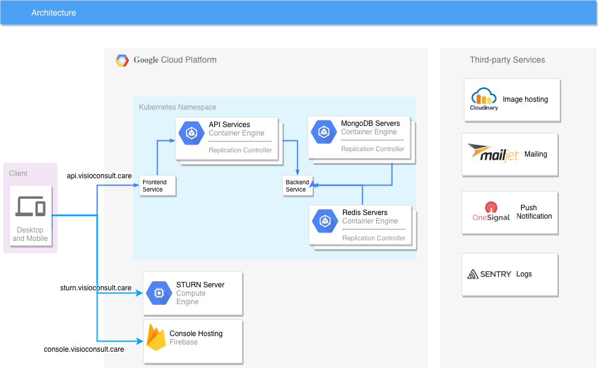

# Visio Consult

Visio Consult platform refers to a technological system that allows individuals to remotely control robots, as well as experience a sense of presence in a remote location through telepresence. With this system, users can operate robots and perform tasks from a distance, such as exploring hazardous environments or conducting inspections. Additionally, the telepresence feature enables individuals to virtually be present in a remote location and interact with the environment, allowing for improved collaboration and communication.

Overall, this platform has various applications, ranging from industrial and commercial settings to healthcare and education. It offers the potential to enhance efficiency, productivity, and safety in various industries while also providing new opportunities for remote work and collaboration.

The project is powered by [Janus WebRTC server](https://janus.conf.meetecho.com) and [React Native WebRTC](https://github.com/react-native-webrtc/react-native-webrtc) 

*   Video presentation : [https://www.youtube.com/watch?v=F3UFjFdHcI8](https://www.youtube.com/watch?v=F3UFjFdHcI8)
*   [Console Website](https://console.visioconsult.care)
*   [Operator Website](https://visioconsult.care)

### Prerequisites

*	[Docker](https://www.docker.com) basic knowledge
*	[Docker composer](https://www.docker.com/products/docker-compose) basic knowledge

### Configuration:

Theses steps will setup the develop environment.
Default environment variables are in the .env file and must be rename to custom .secrets.env file that is automatically read from Docker Compose. 
These custom environment variables include application specific hostnames, certificates, and user credentials:

    cp default.env .secrets.env

### Installation

Start the main application via the command :

    docker-compose up -d

You can tail the logs in this terminal via 

    docker-compose logs api -f
    docker-compose logs console -f

Once the application is ready, you should be able to login to console. The console require administrator for authentication, username:admin and password is [$CONSOLE_PWD](https://gitlab.com/io-team/visioconsult/settings/ci_cd) environment variable :

    http://localhost:4001

The REST API documentation is avaible at :

    http://localhost:3000/explorer

The frontend application is available at :

    http://localhost:4000

# Running Unit tests

Controller and models tests

    docker-compose exex api yarn test

REST API test with Postman:

    docker-compose exec api yarn test-api

## Build individual container 

Each container can be generate individually using the docker build command:

    docker build -t api  --build-arg NODE_ENV=production --build-arg VERSION=1.0.0 ./api
    docker build -t console --build-arg NODE_ENV=production --build-arg VERSION=1.0.0 ./console
    docker build -t frontend --build-arg NODE_ENV=production --build-arg VERSION=1.0.0 ./frontend

Example to deploy webapp to firebase hosting:

    docker run --rm console /bin/sh -c "yarn build  --env.NODE_ENV=production --env.API_URL=https://api.${HOST} && firebase deploy --token $FIREBASE_TOKEN --project $FIREBASE_PROJECT

To generate new FIREBASE_TOKEN install localy the `firebase-tools` first :

    npm i -g firebase-tools@latest
    firebase login:ci

Env variables *FIREBASE_TOKEN* *FIREBASE_PROJECT* are saved in [GitLab CI](https://gitlab.com/io-team/visioconsult/settings/ci_cd)

## Websocket API protocole

[API Protocole](api/Protocole.md)

## Cluster Architecture

### GKE cluster setup

For first setup, you need first to 

Cluster setup uses Helm using the charts. To install the helm :

    curl https://raw.githubusercontent.com/helm/helm/master/scripts/get > get_helm.sh
    chmod 700 get_helm.sh
    ./get_helm.sh

Initialize Helm

    helm init
    
Next you will need cluster admin permissions to install Helm charts. Run the following command to grant admin permision to the cluster to current user: 

    kubectl create clusterrolebinding "cluster-admin-$(whoami)" --clusterrole=cluster-admin --user="$(gcloud config get-value core/account)"
    

Setup DNS Certificat 

    kubectl create secret generic voyager-gce --namespace default --from-literal=GCE_PROJECT=visioconsult-224414 --from-file=GOOGLE_SERVICE_ACCOUNT_JSON_KEY

### Mongodb

Install [Kubedb](https://kubedb.com/docs/0.9.0-rc.2/setup/install/) with helm :

    helm repo add appscode https://charts.appscode.com/stable/
    helm repo update
    helm search appscode/kubedb
    helm install appscode/kubedb --name kubedb-operator --version 0.9.0-rc.2 --namespace kube-system
    helm install appscode/kubedb-catalog --name kubedb-catalog --version 0.9.0-rc.2 --namespace kube-system

And next we create Mongo pod :

    kubedb create -f k8s/mongodb.yaml
    
[DataBase Model Structure](https://drive.google.com/file/d/1TzmoT33Sd6GI82n4jtarxTE0Y5iNeojH/view?usp=sharing)

[helm](https://helm.sh/) is used to setup kubernetes mongodb cluster using [kubedb](https://kubedb.com/) this is done only the first time :

    helm install appscode/voyager --name voyager-operator --version 8.0.1 --namespace kube-system --set cloudProvider=gke

To connect to Mongodb instance in cluster, fisrt forward the 2717 port :

    kubectl port-forward -n infra mongo-0 2717:27017

### Gateway communication

WebRTC enable peer to peer (P2P) communication natively between browsers and mobile application. To establish the communication peers must exchanges their local [ICE description](https://webrtcglossary.com/ice/). [Janus Gateway](https://janus.conf.meetecho.com/) is used to exchanging JSON messages for relaying RTP/RTCP messages between browsers and the server-side application logic.

### UV4L for streaming robot camera feed

Install instruction can be found here [https://www.linux-projects.org/uv4l/installation/](https://www.linux-projects.org/uv4l/installation/)

Required packages:

    apt-get install uv4l uv4l-server uv4l-webrtc

    uv4l -f -k --sched-fifo --mem-lock --config-file=/etc/uv4l/uv4l-uvc.conf --driver uvc --driver-config-file=/etc/uv4l/uv4l-uvc.conf --server-option=--editable-config-file=/etc/uv4l/uv4l-uvc.conf

To test video stream from the robot run the command line :

    curl -s 'http://localhost:8080/janus?gateway_url=https://gateway.visioconsult.care&gateway_root=/&room=7777&publish=1&subscribe=0&hw_vcodec=0&vformat=60&reconnect=1&action=Start' > /dev/null

You should be able to visual the video stream in [https://visioconsult.care](https://visioconsult.care )

To stop the stream

    curl -s 'http://localhost:8080/janus?&action=Stop' > /dev/null

### Turn server 

[Coturn](https://github.com/coturn/coturn/wiki/turnserver) is used in separate Google Comptuer engine instance

First we generate SSL certificates :

    openssl req -x509 -newkey rsa:2048 -keyout /usr/local/etc/turn_server_pkey.pem -out /usr/local/etc/turn_server_cert.pem -days 3001 -nodes    

Next, install coturn using apt-get and copy the default configuration 

    sudo apt-get install coturn
    cp k8s/turnserver.conf /etc/turnserver.conf
    sudo systemctl daemon-reload

Enable auto start on boot

    sudo systemctl enable coturn

Start daemon

    sudo systemctl start coturn

Now check all UDP+TCP ports:

    netstat -tulpn

Firewall inbound rules

    tcp:3478; tcp:5349; udp:3478; udp:5349

### Generating a signing key for Android

You can generate a private signing key using keytool

    keytool -genkey -v -keystore release-key.keystore -alias key-alias -keyalg RSA -keysize 2048 -validity 10000

